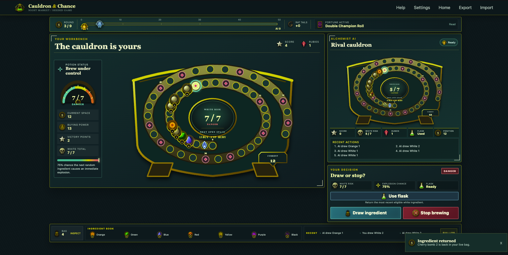

# Cauldron & Chance

**A polished, deterministic, local two-player potion-brewing game — human versus AI.**

Cauldron & Chance is an original browser-based adaptation of a bag-building board-game system. It pairs a React interface with a deterministic TypeScript rules engine, seeded randomness, replayable games, and an AI that makes decisions from the same information available to a player.



## Why this project

This is a portfolio project built to explore the difficult parts of implementing a rules-heavy tabletop game digitally: maintaining a single source of truth for rules, separating game state from rendering, handling hidden information correctly, and making every game reproducible.

The presentation is original. It uses custom SVG/CSS artwork and an original apothecary visual direction; it does not ship commercial reference artwork. See the [asset policy](./docs/ASSET_POLICY.md) for the project's provenance and usage constraints.

## Highlights

- Complete nine-round, human-versus-AI game with a finite shared ingredient supply.
- Deterministic engine with seeded RNG, immutable command dispatch, state validation, save/resume, and replay import/export.
- Information-set Monte Carlo AI: it receives a redacted observation and cannot inspect future bag order or private opponent information.
- Rule-driven special effects, Fortune cards, purchasing, rat tails, flasks, bonus die, end-game scoring, and tie resolution.
- Responsive, keyboard-friendly interface with reduced-motion, high-contrast, and risk-visibility settings.
- Headless simulation, AI benchmark, unit/integration coverage, and Playwright visual QA.

## Technical design

| Area | Approach |
| --- | --- |
| UI | React 19, TypeScript, SVG/CSS presentation |
| Game logic | Pure reducer in `src/engine.ts`; UI renders engine state and legal decisions only |
| Randomness | Seeded, serialized xoshiro RNG consumed by named game and AI events |
| AI | Web Worker with redacted observations and deterministic information-set rollouts |
| Quality | Vitest rules tests, Playwright visual checks, type checking, production builds, and simulations |

The [project documentation](./docs/) records the rules model, phase sequencing, game-state contract, AI constraints, board model, test plan, and resolved design decisions. The authoritative rules model is [docs/RULES_MODEL.md](./docs/RULES_MODEL.md).

## Run it locally

Prerequisite: a current Node.js LTS release and npm.

```sh
npm install
npm run dev
```

Vite prints the local URL when the development server is ready.

## Verify the project

```sh
npm test              # unit and integration tests
npm run typecheck     # TypeScript checks
npm run build         # production build
npm run visual:qa     # Playwright visual and interaction QA
npm run simulate -- 1000
npm run benchmark:ai -- 100
```

## Architecture at a glance

```text
React UI ──────── legal commands ────────► game reducer
   │                                         │
   └────── renders GameState ◄───────────────┘
                                             │
                             redacted observation
                                             │
                                        AI Web Worker
```

Game decisions are represented by a shared pending-decision mechanism. Callers submit only a decision ID and one of the reducer-provided options; the engine validates the command, advances the phase, records events, and rejects stale or illegal actions. This keeps the rules, replay, and UI behavior aligned.

## Engine API

```ts
import {
  createGame,
  dispatch,
  monteCarloCommand,
  observe,
  replayGame,
  serialize,
} from "./src/index.js";

let state = createGame({ seed: "demo-001" });

while (state.phase !== "GAME_OVER") {
  state = dispatch(state, monteCarloCommand(state));
}

const humanView = observe(state, "human");
const savedGame = serialize(state);
const replayed = replayGame({ seed: "demo-001" }, ["droplet", "DRAW"]);
```

`observe` deliberately removes unrevealed Fortune order, private previews, and reducer-only state. Serialization preserves both the PRNG state and pending continuations so an exported game can be resumed or replayed faithfully.

## Scope

The current version is designed for one local human player and one AI opponent on a single device. It intentionally excludes online multiplayer, accounts, back-end services, expansions, and commercial artwork. Product boundaries and implementation choices are documented in the [product specification](./docs/PRODUCT_SPEC.md) and [decisions log](./docs/DECISIONS.md).
